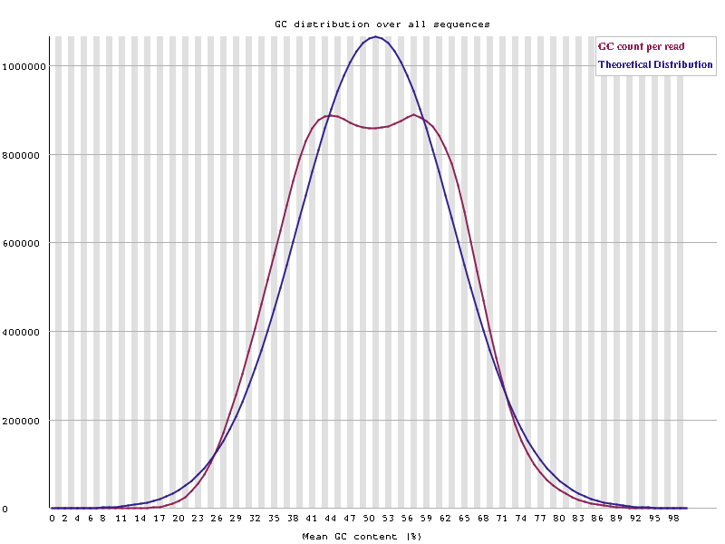

# Обработка экзома  
  

---

## Задача
**Дано**:
- Экзом: id - *ZD210122*, парные прочтения, общий вес - 8G, платформа - MGISEQ-2000, набор - agilent sureselect V6 
- Образец: женщина, 42 года, без описанной потенциальной нозологии

**Цель**: определение нозологии образца, нахождение патогенных вариантов

---

##  Ход работы  
1. Скачан референс (удобнее всего делать wget [отсюда](https://console.cloud.google.com/storage/browser/genomics-public-data))
2. Проведено QC. Единственная проблема бимодального распределения GC-контента [скорее всего связана](https://www.biostars.org/p/175540/) с использованием Agilent sureselect v6. 

3. Скачаны bed файлы для экзома (качать [здесь](https://earray.chem.agilent.com/), требуется ргеистрация, bed файлы искать в разделе *Find design*)
4. Написан [скрипт](make_vcf.sh) для обработки fastq файлов в vcf. В конце скрипта варианты фильтруются по качеству.
5. Загрузка .vcf файлов в [wANNOVAR](https://wannovar.wglab.org/) и [VEP](https://www.ensembl.org/Tools/VEP). Результаты обработки скачаны и названы *annovar.csv* и *vep.txt* соответственно.
6. Написан [срипт](filter.R) для фильтрации вариантов (также в скрипте есть небольшой кусок для визуализации распределения качества неотфильтрованных вариантов). Получена таблица из 7 вариантов.
```R
  chr       start ref   alt     gene_ref_gene          exonic_func_ref_gene          otherinfo6 
1 chr14  24441758 G     A       SDR39U1                nonsynonymous SNV             rs142852673
2 chr19  12897824 C     T       GCDH                   nonsynonymous SNV             rs121434369
3 chr3  108414371 G     A       MYH15                  stopgain                      rs200052069
4 chr11 107560892 A     G       ALKBH8                 startloss                     rs184666895
5 chr17   7437171 -     CCGGGAC TMEM102                frameshift insertion          NA         
6 chr17  43057062 -     G       BRCA1                  frameshift insertion          rs80357906 
7 chr19  34944592 T     A       ZNF30                  stopgain                      rs144833648 
```

7.  Варианты проверены на [varsome](varsome.com) и [franklin](franklin.genoox.com). Определён патогенный вариант на гене BRCA1: описан на [clinvar](https://www.ncbi.nlm.nih.gov/clinvar/variation/17677/?oq=rs80357906&m=NM_007294.4(BRCA1):c.5266dup%20(p.Gln1756fs)), имеет множество communiti notions ([1](https://franklin.genoox.com/clinical-db/variant/snp/chr17-43057062-T-TG-hg38), [2](https://varsome.com/variant/hg38/chr17-43057062%20T%3ETG?annotation-mode=germline&sex=F&zygosity=Heterozygous)) с подтверждённой птаогенностью на использванных ресурсах, в том числе, описанных в гетерозиготном состоянии.

# Результат
Ген BRCA1 известен своей определяющей ролью в формировании рака груди и яичников. Найденный вариант достаточно надёжно связан с данной нозологией, поэтому и выбран для формирования заключения. 